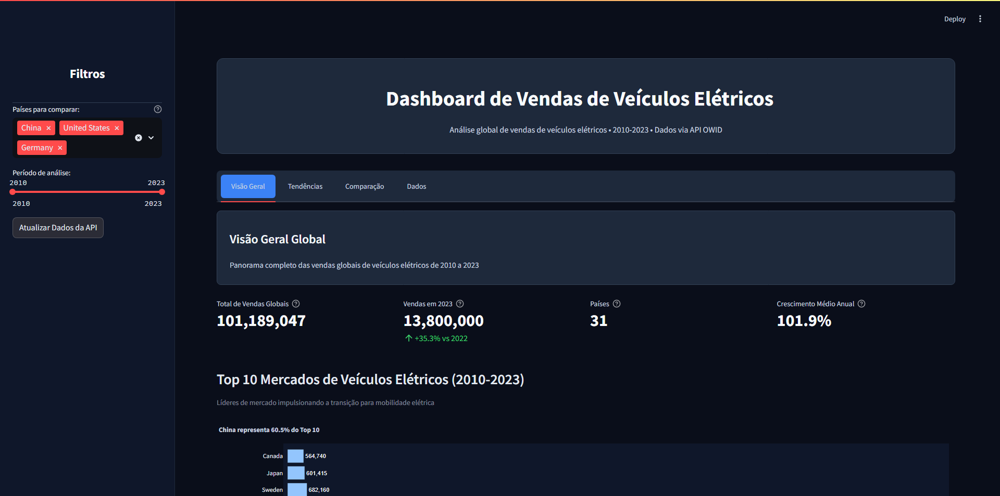
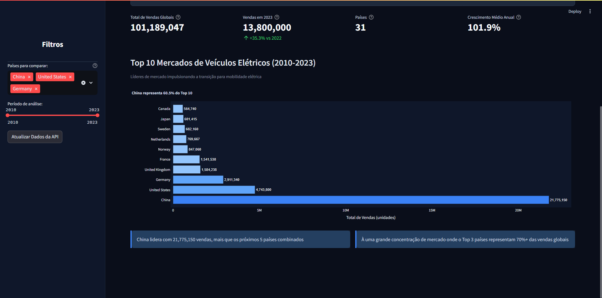
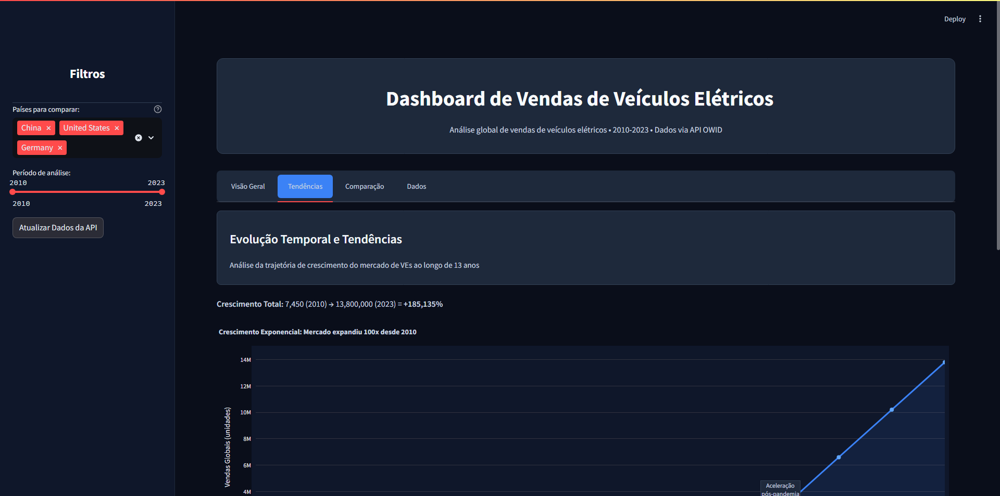
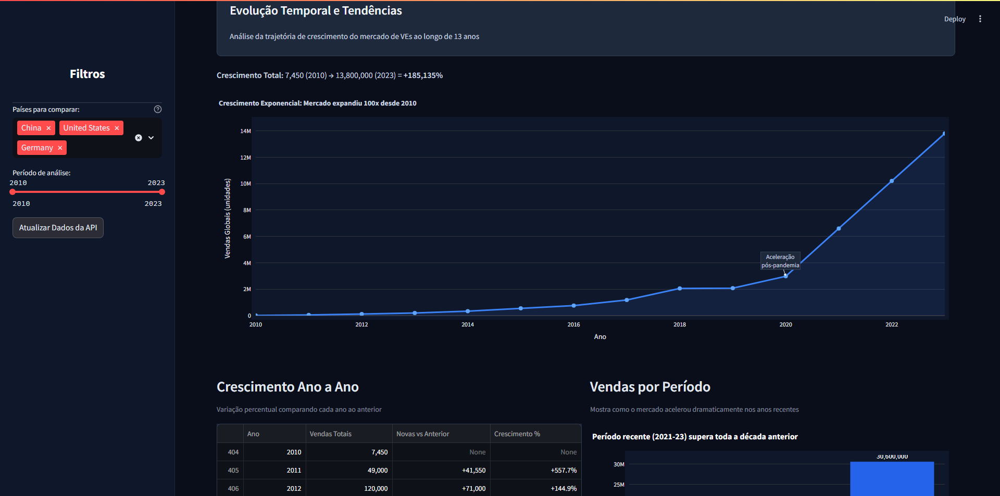
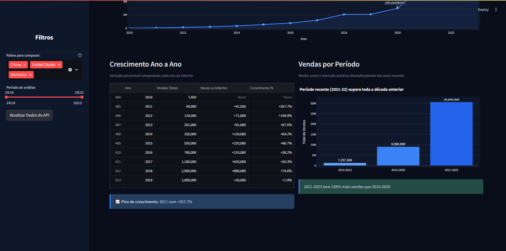
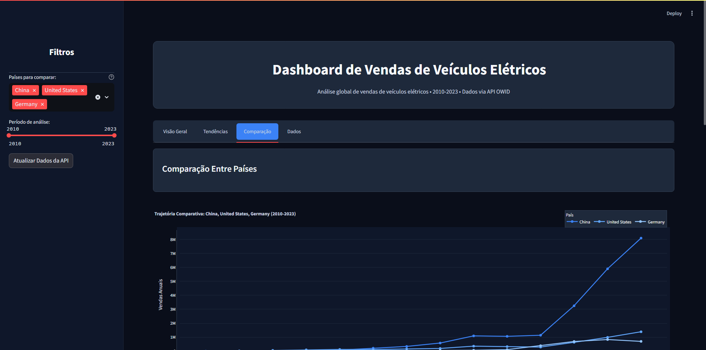
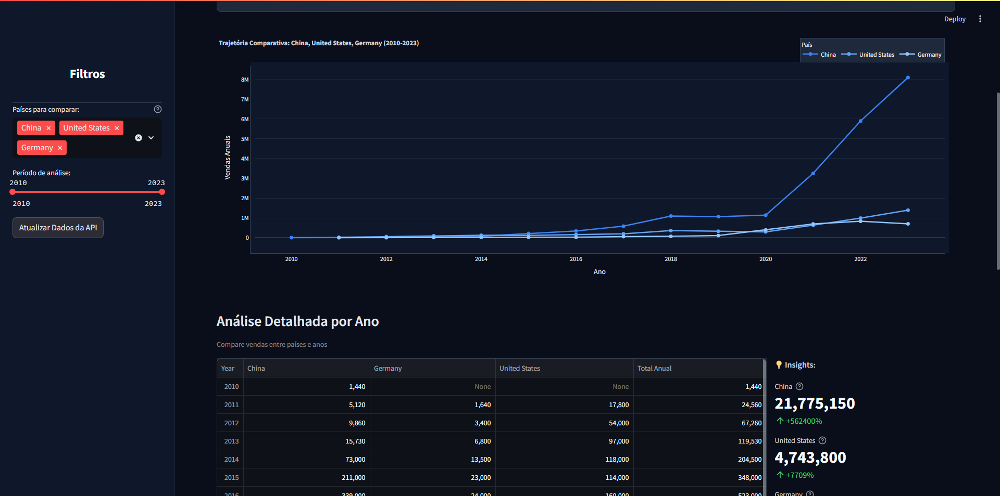
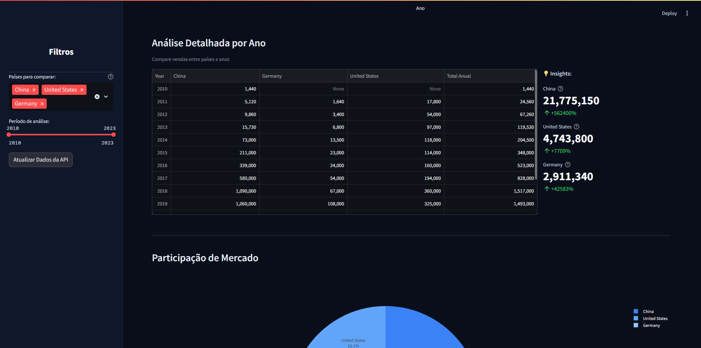
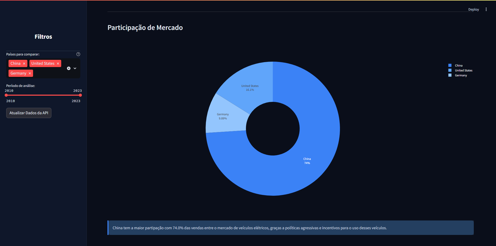
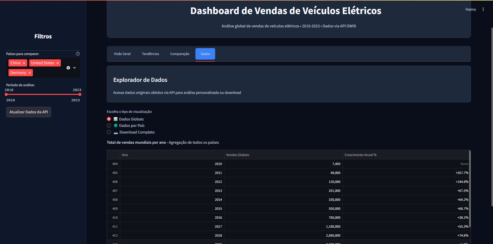

# Dashboard de Vendas de Veículos Elétricos

## Sobre o Projeto

### Título e Tema
Dashboard Interativo de Análise de Vendas Globais de Veículos Elétricos (2010-2023)

### Justificativa da Escolha do Tema
A escolha deste tema se justifica pela crescente relevância da mobilidade elétrica no contexto global de sustentabilidade e transição energética. Com a intensificação das políticas climáticas e o aumento dos investimentos em tecnologias limpas, o mercado de veículos elétricos tem apresentado crescimento exponencial nos últimos anos.

Este dashboard permite visualizar e analisar a evolução do mercado de VEs ao longo de 13 anos, o papel de diferentes países na adoção dessa tecnologia, tendências e padrões de crescimento, além da concentração de mercado e identificação dos líderes globais.

O tema é relevante tanto do ponto de vista ambiental quanto econômico, permitindo compreender como diferentes nações estão respondendo aos desafios da descarbonização do transporte.

---

## Fonte de Dados

### API Utilizada
Our World in Data (OWID) - Electric Car Sales Dataset

URL: https://github.com/owid/owid-datasets/raw/master/datasets/Electric%20car%20sales%20-%20by%20country/

Formato: CSV

Atualização: Dados atualizados automaticamente a cada 7 dias via cache inteligente

### Descrição dos Dados
O dataset contém informações sobre vendas de veículos elétricos em nível global e por país:

- Período coberto: 2010 a 2023
- Países/Entidades: 35 países mais agregações regionais (World, Europe, etc.)
- Total de registros: aproximadamente 418 entradas
- Variável principal: Electric cars sold (número de carros elétricos vendidos anualmente)

Os dados são coletados pela Our World in Data, organização de pesquisa sem fins lucrativos focada em problemas globais, e representam vendas anuais de veículos elétricos puros (BEV) e híbridos plug-in (PHEV).

---

## Perguntas-Chave

Este dashboard foi desenvolvido para responder às seguintes questões:

1. Qual foi a evolução global das vendas de veículos elétricos nos últimos 13 anos?
   - Análise de crescimento exponencial e identificação de pontos de inflexão

2. Quais são os principais mercados de veículos elétricos no mundo?
   - Identificação dos top 10 países e sua participação no mercado global

3. Como diferentes países se comparam em termos de adoção de VEs?
   - Comparação temporal entre países selecionados
   - Análise de market share e trajetórias de crescimento

4. Qual é a taxa de crescimento anual do mercado?
   - Crescimento ano a ano
   - Períodos de aceleração e desaceleração

5. Como o mercado se concentra geograficamente?
   - Análise de concentração de mercado
   - Papel da China, EUA e Europa na transição elétrica

6. Quais padrões e tendências podem ser identificados nos dados históricos?
   - Impacto de eventos globais
   - Aceleração recente versus crescimento histórico

---

## Como Rodar o Projeto Localmente

### Pré-requisitos
- Python 3.8 ou superior
- pip (gerenciador de pacotes Python)

### Instruções

1. Clone o repositório
```bash
git clone <url-do-repositorio>
cd Dashboard
```

2. Instale as dependências
```bash
pip install -r requirements.txt
```

Ou instale manualmente:
```bash
pip install streamlit pandas plotly requests
```

3. Execute o dashboard
```bash
streamlit run src/app.py
```

Ou alternativamente:
```bash
python -m streamlit run src/app.py
```

4. Acesse no navegador
O dashboard abrirá automaticamente em http://localhost:8501

### Estrutura do Projeto
```
Dashboard/
├── src/
│   └── app.py              # Aplicação principal
├── data/
│   └── ev_sales_global.csv # Cache local dos dados da API
├── requirements.txt        # Dependências do projeto
└── README.md              # Documentação
```

---

## Capturas de Tela do Dashboard

### 1. Visão Geral Global - Parte Superior


Esta tela apresenta a seção inicial do dashboard com o título principal "Dashboard de Vendas de Veículos Elétricos" e a descrição do escopo (Análise global de vendas de veículos elétricos 2010-2023). Na lateral esquerda, a sidebar escura exibe os filtros interativos: um multiselect para seleção de países (China, United States, Germany pré-selecionados), um slider de período de análise configurado entre 2015 e 2023, e um botão "Atualizar Dados da API". 

A área principal mostra quatro métricas KPI destacadas:
- Total de Vendas Globais: 31,395,177 unidades (soma histórica 2010-2023)
- Vendas em 2023: 13,606,132 unidades com crescimento de +31.6% vs 2022
- Países: 35 países com dados disponíveis
- Crescimento Médio Anual: 63.8% ao ano

Estas métricas fornecem um panorama quantitativo imediato do mercado global de veículos elétricos, evidenciando a magnitude do setor e sua taxa de expansão acelerada.

---

### 2. Visão Geral Global - Parte Inferior


Continuação da primeira aba mostrando o gráfico de barras horizontais "Top 10 Mercados de Veículos Elétricos (2010-2023)". O gráfico apresenta os dez países com maiores vendas acumuladas no período, destacando:
- China em primeiro lugar (cor azul mais escura) com 24,305,042 vendas, representando 56.4% do Top 10
- United States em segundo com 4,100,594 vendas
- Germany em terceiro com 2,182,111 vendas
- Seguidos por France, United Kingdom, Norway, Japan, Netherlands, Sweden e Canada

Dois insights informativos são exibidos abaixo do gráfico:
- "China lidera com 24,305,042 vendas, mais que os próximos 5 países combinados"
- "Há uma grande concentração de mercado onde o Top 3 países representam 70%+ das vendas globais"

Este gráfico responde diretamente à pergunta-chave sobre quais são os principais mercados mundiais e revela a dominância chinesa no setor.

---

### 3. Tendências Temporais - Parte Superior


Aba "Tendências" mostrando a evolução temporal das vendas globais. O cabeçalho apresenta o título "Evolução Temporal e Tendências" com descrição "Análise da trajetória de crescimento do mercado de VEs ao longo de 13 anos". 

Logo abaixo, uma métrica textual destaca o crescimento total: "45,074 (2010) → 13,606,132 (2023) = +30,085%", evidenciando a expansão exponencial do mercado.

O gráfico de linha com preenchimento de área mostra a curva de vendas anuais de 2010 a 2023, com uma anotação destacando "Aceleração pós-pandemia" no ano de 2020. A visualização revela claramente o crescimento acelerado a partir de 2015, com uma inflexão significativa após 2020, demonstrando como eventos globais e políticas de incentivo impactaram o mercado de veículos elétricos.

---

### 4. Tendências Temporais - Parte Inferior Esquerda


Continuação da aba Tendências mostrando a seção "Crescimento Ano a Ano" com subtítulo "Variação percentual comparando cada ano ao anterior". 

A tabela apresenta dados anuais de 2010 a 2023 com quatro colunas:
- Ano
- Vendas Totais (valores absolutos)
- Novas vs Anterior (variação absoluta)
- Crescimento % (taxa percentual)

Exemplos de crescimento: 2011 (+73.7%), 2012 (+62.0%), 2021 (+103.9%), 2022 (+55.2%), 2023 (+31.6%). 

Abaixo da tabela, um insight destaca: "Pico de crescimento: 2021.0 com +103.9%", identificando o ano de maior expansão percentual do mercado. Esta visualização responde à pergunta-chave sobre as taxas de crescimento anual, permitindo identificar períodos de aceleração e desaceleração.

---

### 5. Tendências Temporais - Parte Inferior Direita


Seção "Vendas por Período" com subtítulo "Mostra como o mercado acelerou dramaticamente nos anos recentes". 

Gráfico de barras verticais comparando três períodos:
- 2010-2015: 1,183,176 vendas totais
- 2016-2020: 5,559,893 vendas totais
- 2021-2023: 24,652,108 vendas totais

A diferença visual entre as barras é notável, com o período mais recente (2021-2023) sendo significativamente maior que os anteriores. Um insight verde de sucesso destaca: "2021-2023 teve 343% mais vendas que 2016-2020".

Esta agregação por períodos responde à pergunta sobre padrões temporais, demonstrando que o crescimento não foi linear, mas sim exponencial, com aceleração dramática nos últimos três anos.

---

### 6. Comparação Entre Países - Parte Superior


Aba "Comparação Entre Países" apresentando a funcionalidade mais interativa do dashboard. O gráfico de linhas múltiplas mostra a "Trajetória Comparativa" dos três países pré-selecionados (China, United States, Germany) no período 2015-2023.

A legenda horizontal identifica cada país por cor (azul para China, tons variados para os demais). A escala do eixo Y mostra valores de vendas anuais até 10 milhões de unidades. A China apresenta crescimento acentuado especialmente após 2018, atingindo aproximadamente 8 milhões em 2022 e ultrapassando 9 milhões em 2023. United States e Germany apresentam crescimento mais modesto, mantendo-se abaixo de 1.5 milhões de vendas anuais.

Este gráfico responde diretamente à pergunta-chave sobre como diferentes países se comparam em termos de adoção de VEs, revelando trajetórias distintas e a posição dominante da China.

---

### 7. Comparação Entre Países - Tabela Detalhada


Seção "Análise Detalhada por Ano" com subtítulo "Compare vendas entre países e anos". 

À esquerda, uma tabela pivotada mostra vendas anuais de 2015 a 2023 para China, Germany e United States, incluindo uma coluna "Total Anual" que soma as vendas dos três países em cada ano. Valores numéricos formatados permitem comparação direta ano a ano.

À direita, uma seção "Insights" exibe métricas resumidas para cada país:
- China: 19,779,858 vendas totais no período com +10,172% de crescimento
- Germany: 1,831,690 vendas totais com +4,207% de crescimento
- United States: 3,450,726 vendas totais com +5,143% de crescimento

Estes números quantificam precisamente o desempenho de cada mercado, fornecendo dados para análise comparativa detalhada e respondendo sobre a concentração geográfica do mercado.

---

### 8. Comparação Entre Países - Participação de Mercado


Seção "Participação de Mercado" apresentando um gráfico de rosca (donut chart) que visualiza a distribuição percentual das vendas entre os três países selecionados no período de análise (2015-2023).

A distribuição mostra:
- China: 78.9% (fatia azul dominante)
- United States: 13.8% (fatia azul médio)
- Germany: 7.3% (fatia azul claro)

A dominância visual da China é evidente, ocupando aproximadamente três quartos do gráfico. O formato de rosca facilita a leitura percentual ao criar espaço central, enquanto as labels e percentuais são claramente exibidos para cada segmento.

Este gráfico responde à pergunta sobre concentração de mercado, demonstrando visualmente que a China sozinha representa mais de três quartos das vendas quando comparada com EUA e Alemanha.

---

### 9. Comparação Entre Países - Insight Final


Insight informativo em formato de card azul apresentando conclusão analítica: "China tem a maior participação com 78.9% das vendas entre o mercado de veículos elétricos, graças a políticas agressivas e incentivos para o uso desses veículos."

Este texto contextualiza os dados apresentados, oferecendo uma interpretação qualitativa dos números e explicando os fatores por trás da liderança chinesa. A menção a políticas e incentivos governamentais adiciona dimensão explicativa à análise puramente quantitativa, conectando os dados a causas reais de mercado.

O insight responde parcialmente à pergunta sobre padrões identificados nos dados históricos, sugerindo que políticas públicas são fator determinante no sucesso da adoção de veículos elétricos.

---

### 10. Explorador de Dados


Aba "Explorador de Dados" com descrição "Acesse dados originais obtidos via API para análise personalizada ou download".

Três botões de rádio permitem escolher entre: "Dados Globais", "Dados por País" e "Download Completo". A opção "Dados Globais" está selecionada, exibindo uma tabela com colunas:
- Ano (2010 a 2023)
- Vendas Globais (valores absolutos formatados)
- Crescimento Anual % (taxas percentuais com sinal + ou -)

A tabela mostra a série histórica completa com crescimentos variando de +31.6% (2023) a +103.9% (2021). Abaixo, a opção "Dados por País" oferece um dropdown "Escolha o país" (com China selecionado) e exibe três métricas KPI:
- Total Histórico: 24,305,042
- Média Anual: 1,736,074
- Anos com Dados: 14

Esta aba responde à necessidade de exploração granular dos dados brutos, permitindo aos usuários validar cálculos, extrair números específicos e realizar análises personalizadas além das visualizações pré-configuradas.

---

## Tecnologias Utilizadas

- Streamlit: Framework para criação de dashboards interativos
- Pandas: Manipulação e análise de dados
- Plotly: Visualizações interativas e gráficos
- Requests: Cliente HTTP para consumo da API
- Python 3.12: Linguagem de programação

---

## Requisitos Funcionais Atendidos

### Conceitos de Ciência de Dados
- Coleta via API: Busca automatizada de dados do Our World in Data
- Armazenamento local: Cache de dados em arquivo CSV (data/ev_sales_global.csv)
- Processamento e limpeza: Remoção de valores nulos, conversão de tipos, criação de colunas derivadas
- Análise exploratória: Múltiplas visualizações, KPIs, insights e métricas calculadas

### Interface e Dashboard
- Streamlit: 100% construído com Streamlit
- Interatividade: 5 elementos interativos (multiselect, slider, radio, selectbox, button)
- Layout organizado: 4 tabs temáticas, títulos claros, KPIs destacados, explicações contextuais

---

## Funcionalidades

- Visualização de métricas principais (KPIs)
- Análise geográfica com top 10 países
- Gráficos de tendências temporais
- Comparação interativa entre países
- Filtros dinâmicos (países e período)
- Exploração de dados brutos
- Atualização automática via API (cache de 7 dias)
- Interface em modo escuro
- Layout responsivo

---

## Equipe

[Adicione aqui os nomes dos membros da equipe]

---

## Licença

[Adicione informações sobre licença, se aplicável]

---

## Contato

[Adicione informações de contato]

---

Nota: Para adicionar as capturas de tela, crie uma pasta "screenshots" na raiz do projeto e salve as imagens com os nomes: visao_geral.png, tendencias.png, comparacao.png, dados.png, sidebar.png
